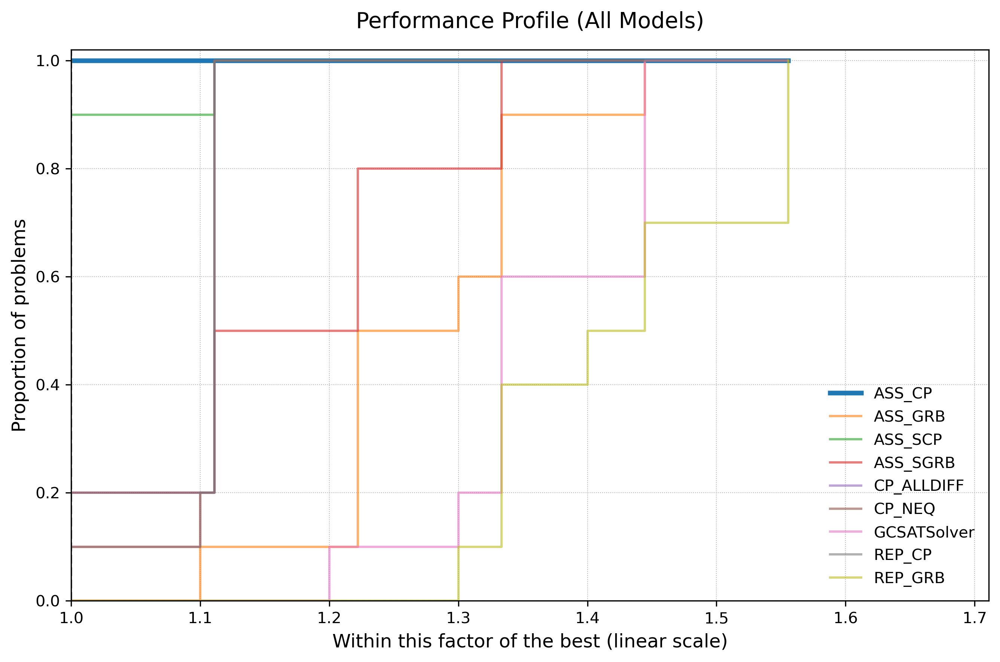
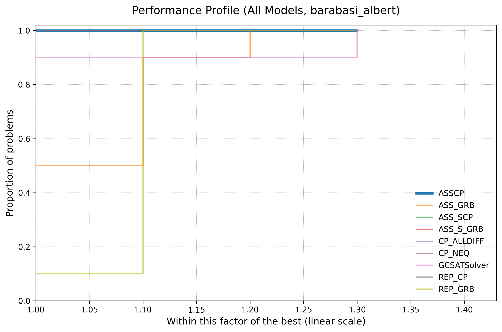
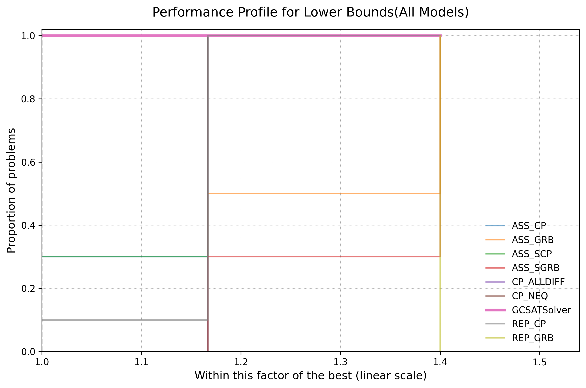
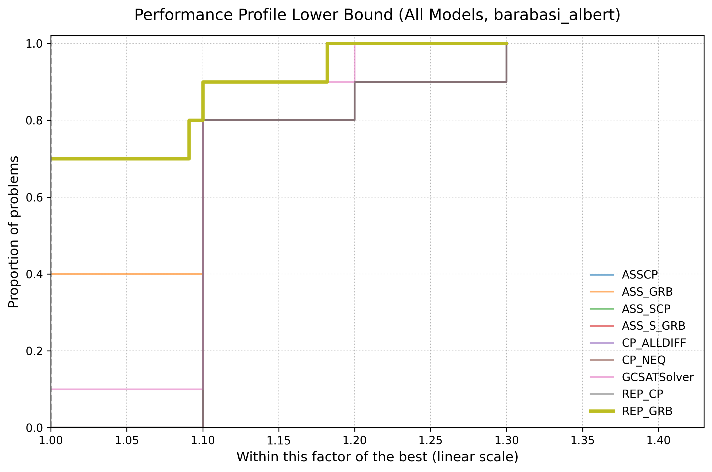
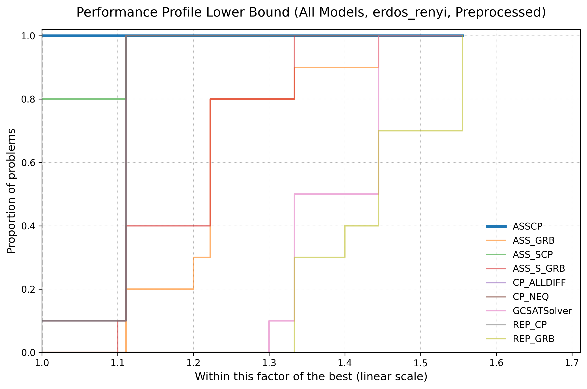
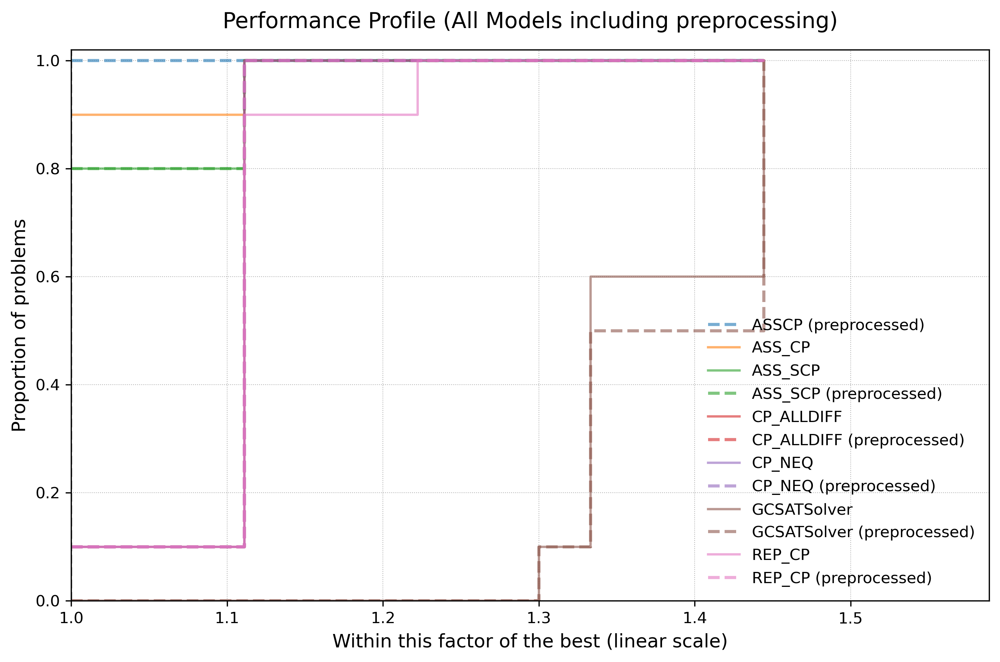
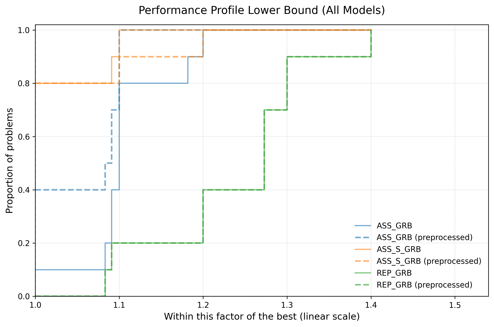
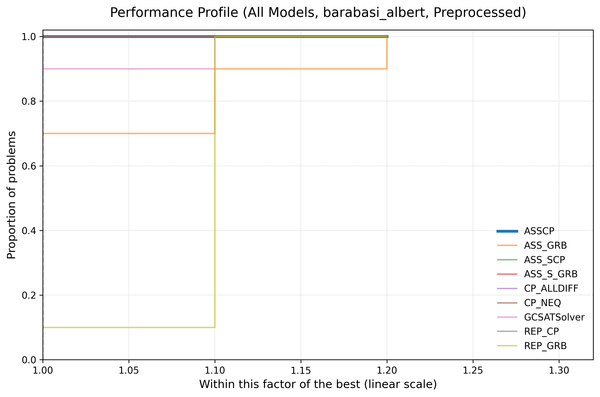
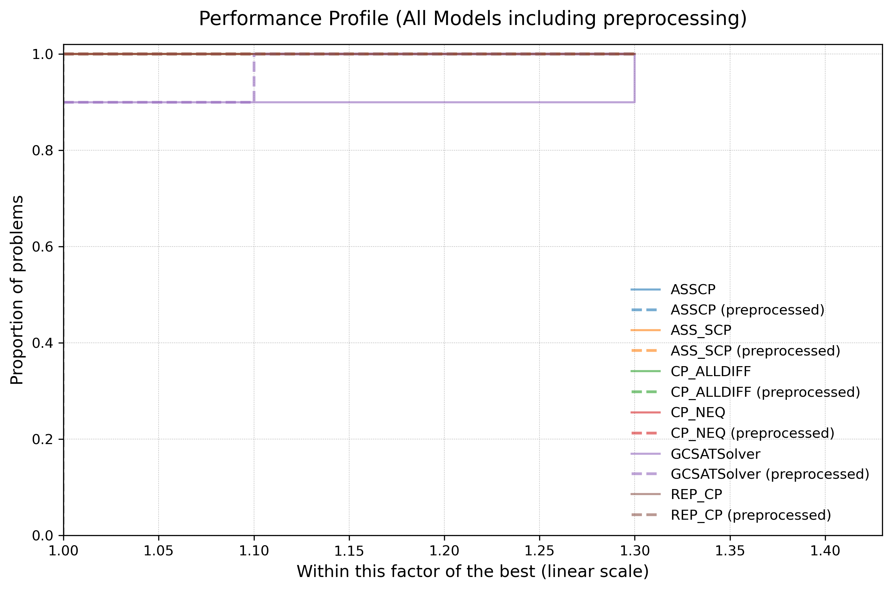
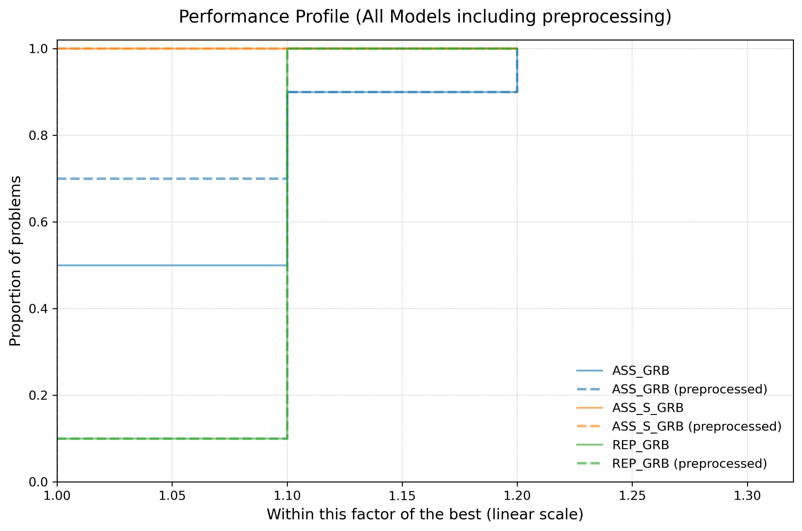

# Evaluating the different Models
We evaluate the performance of the different solvers and implementations using performance profiles on a 60 second time-limit and 10 different graphs at a time. For the graphs, we generated 10 instances of erdos-renyi graphs, each having above 150 nodes and an edge probability of 0.4. We also generated 10 barabasi-albert graphs, each having above 210 nodes and an m-value of 15. We used both graph types separately determine differences in performances across solvers.

## Performance on the objective value
### Erdos-Renyi Graphs
For these graphs, the 60 second performance profile looks as follows:

The assignment-based CP-SAT solver performs the best, finding the best solution across all instances. The representative-based Gurobi solver performs the worst, finding an objective value within 55% of the best for all instances (in the worst case). Interestingly, the CP-SAT implementation of the same method performs far better, being the third best performing solver.

This can be observerd for almost all methods: the CP-SAT implementation finds a better value more often than the Gurobi implementation. This might lead one to believe that CP-SAT finds good solution quickly, while Gurobi takes longer.

### Barabasi-Albert Graphs
For these graphs, the 60 second performance profile looks as follows:

While almost all solvers found the same values for these graphs, none of them proved optimality and all timed out. Regardless, this profile differs a lot from the one above, with most solvers seemingly performing the same. However, just like with the Erdos-Renyi Graphs, the REP_GRB solver performed the worst, with the ASS_GRB solver being second to last.

Notably, the pure SAT solver finds the best solution for90% of instances, but reaches the top last, finding asolution only within 30% of the best known for all instances.

## Performance of finding Lower Bounds
### Erdos-Renyi Graphs
For these graphs, the 60 second performance profile for thelower bound looks as follows:

The pure SAT solver, ASS_CP, and CP_ALLDIFF find the best lower bound after 60 seconds, while REP_GRB performs the worst, finding a lower bound within 40% of the best known for all instances.

### Barabasi-Albert Graphs
For these graphs, the 60 second performance profile for the lower bound looks as follows:

Here, the GCSATSolver performs the best, being alone on the podium. Interestingly, the CP_NEQ solver performs the worst, while the REP_GRB solver improved greatly, finding a lower bound within 11% of the best known for all instances.
Even though the ASS_CP and CP_ALLDIFF solver perform slightly worse, all solvers perfrom more similarly than with the Erdos-Renyi Graphs.

## Performance on the objective value with preprocessing 
Here, we implemented the Preprocessor and applied it to the 20 different graphs of the benchmarking set. On average, the instances were reduced by 5 - 6 nodes. <!--, with the Erdos-Renyi Graphs reducing the most and the Barabasi-Albert Graphs the least. -->

### Erdos-Renyi Graphs
For these preprocessed graphs, the 60 second performance profile looks as follows:

Of course, this is not informative on the impact of solver performance, so we plot the solvers objective values with and without preprocessing. To avoid clutter, we split the solvers into two plots, one with the CP-SAT and pure SAT solvers, and one with the Gurobi solvers.

#### CP-SAT and pure SAT

_Note: because of a naming accident, the ASS_CP solver has a blue-dotted and yellow line, instead of a blue-solid line._

A performance increase can be seen for:
- ASS_CP, finding the best known solution for all instances instead of only for 90%
- REP_CP, finding a solution within 12% of the best for all instances instead of within 23%

Curiosly, the GCSATSolver performs worse with preprocessing than without, finding a solution within 33% of the best for 50% of instances instead of for 60% of instances without the preprocessing.
This may be due to general fluctuations in the calculating process, which can have a big impact since the sample size is only 10 (difference in the datasat is one value being 13 instead of 12).
 

#### Gurobi 

The REP_GRB solver sees no improvement, while the ASS_GRB improves greatly, finding the best known solution for 40% of instances instead of 10% and climbing faster. The ASS_S_GRB solver performed slightly worse with the preprocessing applied. 

### Barabasi-Albert Graphs

For these preprocessed graphs, the 60 second performance profile looks as follows:

Like before, the split the plot into two groups and compare directly with the performance without preprocessing.

#### CP-SAT and pure SAT

We can see that basically all solvers perform the same, with or without preprocessing. The GCSATSolver however, shows great improvement, finding a value within 10% of the best known for all instances with preprocessing. Before, the solver only found a value within 30% for all instances.

#### Gurobi

Similarly, the Gurobi solvers performed largely the same. The ASS_GRB solver improved and was able to find the best known solution for 70% of all instances, compared to 50% of instances before. For finding a solution within 10% or more of the best known, both variant performed the same again.

The fact that most solvers did not experience an impact, is likely due to the fact that the preprocessing technique could not be applied to these graphs properly, leading to only a small reduction in graph size. 

<!-- These graphs are constructed so that every node is connected to a certain number of other nodes, resulting in a lot of cliques of the same size and thus, reducing the effect of the preprocessor. -->
